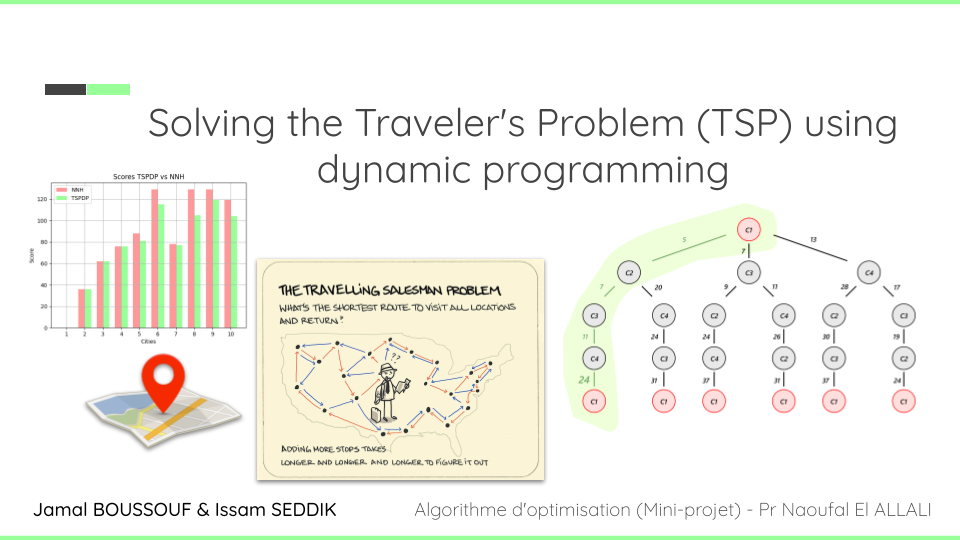

# Solving the Traveler's Problem (TSP) using dynamic programming

In exploring the Traveling Salesman Problem (TSP), we navigate through various algorithmic approaches, from exhaustive brute force to sophisticated Dynamic Programming (DP) techniques. TSP, a quintessential optimization problem, holds relevance across logistics, transportation, and network routing domains. Our study showcases the trade-offs between solution quality and computational efficiency inherent in each method. Through empirical evaluations and comparative analyses, we demonstrate the efficacy of DP in efficiently computing near-optimal tours, particularly for moderate-sized problem instances. Leveraging practical tools such as Streamlit for interface development and graphical representations for solution visualization, we provide intuitive insights into TSP problem-solving. Moreover, our investigation highlights the significance of algorithm selection and methodology in addressing optimization challenges. The project's availability on GitHub fosters collaboration and further exploration in the field of optimization research. Looking ahead, continued advancements in optimization promise to drive innovation and foster transformative solutions for real-world applications. Through this comprehensive exploration, we offer valuable insights into the complexities and nuances of TSP problem-solving, setting the stage for future advancements in optimization methodologies.

## Authors

- [@iseddik](https://github.com/iseddik)
- [@jamal-boussouf](https://github.com/jamal-boussouf)

## 🔗 Links
- 
- 